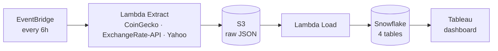

# Aurum — Serverless Market Data ETL on AWS

A serverless ETL pipeline that captured crypto, currency, precious metal and oil prices every 6 hours, staged them in Amazon S3 and loaded them into Snowflake for a Tableau dashboard. It ran from **June 27 to July 11, 2026**.

The cleaned captures from this pipeline now live on in **[Vectes](https://github.com/AristoclesofStgo/vectes)**, an interactive market-data website, where they are shown in the Data Lab and reconciled against a reference history.

**Live site → [aristoclesofstgo.github.io/vectes](https://aristoclesofstgo.github.io/vectes/)**

## Architecture



1. **Extract** (`lambdas/extract`): calls CoinGecko (crypto), ExchangeRate-API (FX) and Yahoo Finance (metals and oil futures), and writes one raw JSON file per source to `s3://<bucket>/raw/<source>/YYYY/MM/DD/HHMMSS.json`.
2. **Load** (`lambdas/load`): reads every file under `raw/`, inserts the records into the matching Snowflake table and moves the file to `processed/`.
3. **Serve**: the Snowflake tables were exported to CSV and merged for the Tableau dashboard (`tableau/`).

## Lessons learned

Cleaning the exports later (in Vectes) surfaced a few real issues in this pipeline:

| Issue | Impact |
|---|---|
| Some S3 files were loaded into Snowflake more than once | **72%** of exported rows (2,891 of 4,007) were exact duplicates. The load step was not idempotent. |
| Manual test runs on June 28 | 120 extra snapshots outside the 6-hour schedule |
| `OPEN_PRICE` for metals and oil was the open from 7 days earlier | The "24h change" column was really a weekly change |
| The free ExchangeRate-API publishes once a day | Most 6-hour FX captures repeat the previous value |

The fixes (deduplication, snapping to schedule slots, stale-value flags) are documented in the [Vectes data quality notes](https://github.com/AristoclesofStgo/vectes#data-quality-what-the-data-taught-me).

## Tech stack

AWS Lambda (Python) · Amazon S3 · Amazon EventBridge · Snowflake · Tableau

## Repository structure

```
├── lambdas/
│   ├── extract/                 # APIs → S3 (raw JSON)
│   └── load/                    # S3 → Snowflake
├── snowflake/setup.sql          # Warehouse DDL (4 tables)
├── tableau/                     # Exports, merge script and the Tableau dashboard
├── docs/index.html              # Redirect from the old website URL to Vectes
└── .env.example
```

## Running it

1. Copy `.env.example` to `.env` and fill in the AWS, Snowflake and ExchangeRate-API values.
2. Create the S3 bucket and run `snowflake/setup.sql`.
3. Package and deploy `lambdas/extract` and `lambdas/load` to AWS Lambda (Python 3.11), installing each folder's `requirements.txt` into the package.
4. Schedule the extract Lambda with EventBridge (every 6 hours) and trigger the load Lambda from S3.
